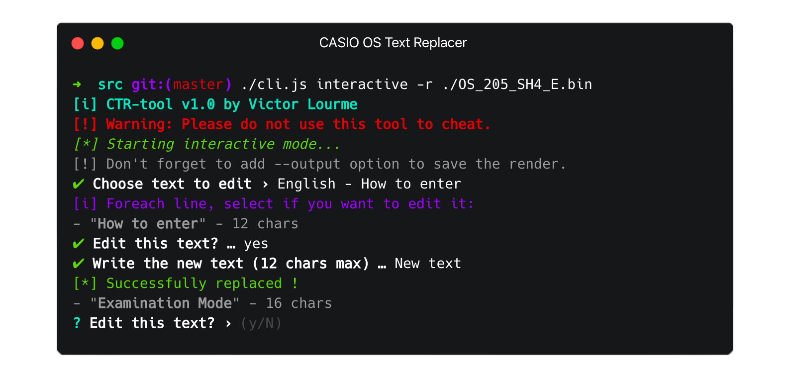
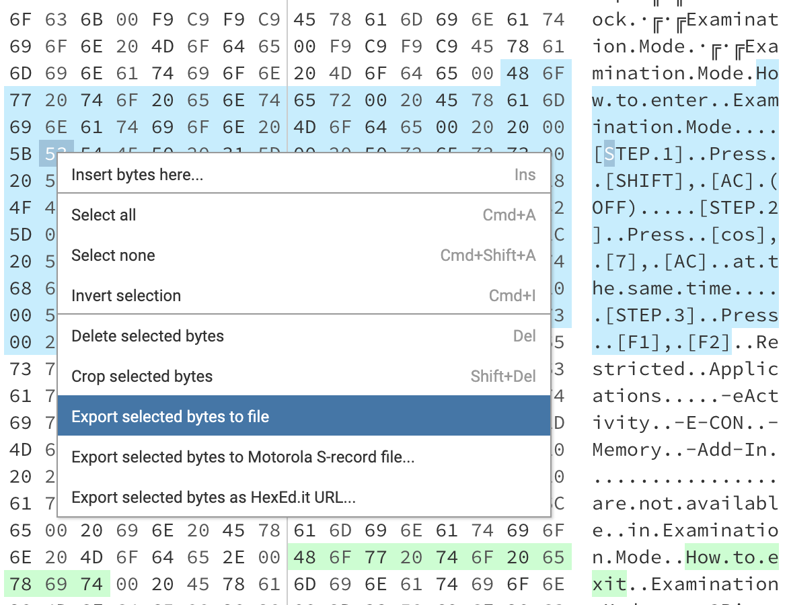
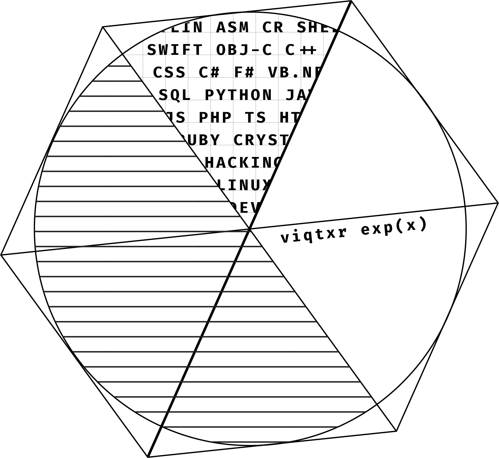

    
    Casio Text Replacer API

## Disclaimer
> **This tool is not made to cheat nor to incite people to cheat on their exams. This is for education purposes only and I'm not responsible in case of wrong usage of this tool.**

## How it works ?
**Note:** This is designed for Casio 35+E and 75+E, I recommand upgrading your system to the 75+E one if you're having a 35+E model.

This tool will cut and format correctly the text from the binary file of the OS and let you replace texts with something other. This is a pretty simple process, the only thing is to respect breaks from the system and there are two types:
- `00 20`, that I'll call *basic break*.
- repeated occurences of `20 20`, that I'll call *long break*.
- `00 20 20 00`, that I'll call *advanced break*.

Once we identified **breaks and every texts with their maximum lengths**, we're able to replace them and **render a new binary file**.

**Warning, the tool can't take the entire OS binary, it will just cause a crash.** *This is why, the binary must be delimited to the text only like here on [hexed.it](https://hexed.it):*

    

## Usage
> This is a partial guide, maybe not everything is useful or correct, these are just some ideas.

1. Get your calculator OS binary (ex: OS_205_SH4_E.bin for Casio 75+E).
2. Open it on a hex-editor and find text you want to edit
3. Export the binary of the text in a single file
4. Use this tool on the binary you just exported
5. Replace the old binary text with the new binary that the tool made into the original OS binary
6. Correct your binary (often you'll need to patch OS size or checksum, use PolyOS for example).
7. Flash the system with the flashing software (e.g.: FxRemote)

## Notes
- **Again, this is not made to cheat on exams.**
- This is an experiment, expect bugs and this is not a finished tool, a lot of edits are coming.

## Credits

    
     
    <b>Viqtxr Experiments.</b>

